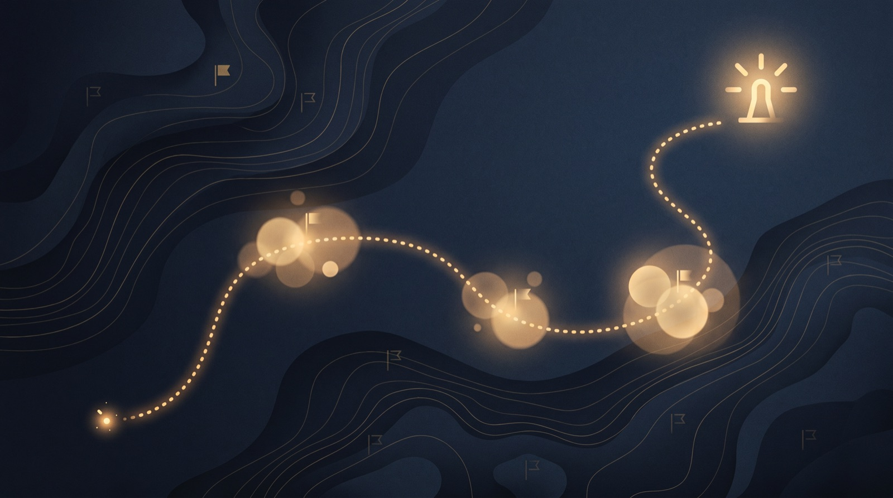
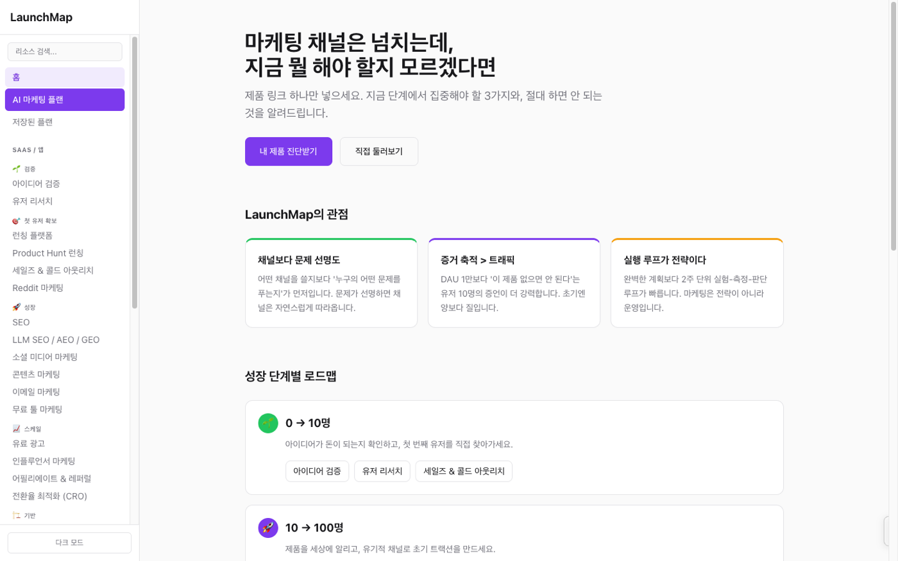

<p align="center">
  
</p>

# LaunchMap

**마케팅 채널은 넘치는데, 지금 뭘 해야 할지 모르겠다면.**

제품 링크 하나를 넣으면 AI가 제품과 단계를 분석해, **지금 집중해야 할 3가지**와 **절대 하면 안 되는 것**을 알려주는 초기 스타트업 마케팅 의사결정 도구입니다. 링크 모음이 아니라 결정 도구입니다.

**라이브**: https://launchmap.vercel.app

<p align="center">
  
</p>

## 왜 만들었나

초기 창업자의 문제는 정보 부족이 아니라 **우선순위 부재**입니다. SEO, Product Hunt, 콜드 아웃리치, 인플루언서… 채널 목록은 어디에나 있지만 "지금 단계의 나"가 뭘 해야 하는지 말해주는 곳은 없습니다. LaunchMap의 관점은 세 가지입니다:

1. **채널보다 문제 선명도** — 어떤 채널을 쓸지보다 '누구의 어떤 문제를 푸는지'가 먼저입니다.
2. **증거 축적 > 트래픽** — DAU 1만보다 "이 제품 없으면 안 된다"는 유저 10명의 증언이 강력합니다.
3. **실행 루프가 전략이다** — 완벽한 계획보다 2주 단위 실험-측정-판단 루프가 빠릅니다.

## 기능

- **AI 마케팅 플랜**: 제품 URL/설명 → Claude가 제품·단계 분석(`/api/analyze`) → 큐레이션 리소스 DB에 근거한 단계별 실행 플랜 생성(`/api/generate`). 생성된 플랜은 저장·재열람 가능.
- **성장 단계별 로드맵**: 0→10 / 10→100 / 100→1,000명, 단계마다 검증된 플레이북과 리소스.
- **리소스 맵**: SaaS/앱 22개 카테고리 (검증, 첫 유저 확보, SEO, LLM SEO/AEO, 콘텐츠, 유료 광고, CRO 등).
- **게임 마케팅 섹션**: 인디/모바일 게임 전용 12개 카테고리 — Steam 위시리스트, 스토어 페이지, 커뮤니티 빌딩 등. 게임 제품이 감지되면 플랜 생성도 게임 리소스 기준으로 동작.
- 다크 모드, 모바일 대응, 리소스 검색.

## 스택

Next.js (App Router) · TypeScript · Tailwind CSS · Claude API (`@anthropic-ai/sdk`) · Vercel Postgres

## 로컬 실행

```bash
git clone https://github.com/dennykim123/launchmap
cd launchmap && npm install

# .env.local
# ANTHROPIC_API_KEY=...     (AI 플랜 생성)
# POSTGRES_URL=...          (플랜 저장 — Vercel Postgres)

npm run dev
```

AI 키 없이도 리소스 맵/로드맵 브라우징은 동작합니다. 플랜 생성만 키가 필요합니다.

## English

LaunchMap is a marketing decision tool for early-stage founders (Korean-first UI). Paste your product link — Claude analyzes the product and stage, then generates a phased plan grounded in a curated resource database (22 startup categories + 12 game-marketing categories), telling you the 3 things to focus on now and what not to do. Opinionated by design: problem clarity over channels, evidence over traffic, execution loops over strategy decks.

## Credits

Hero image is AI-generated for this project; no copyright is claimed on it.
